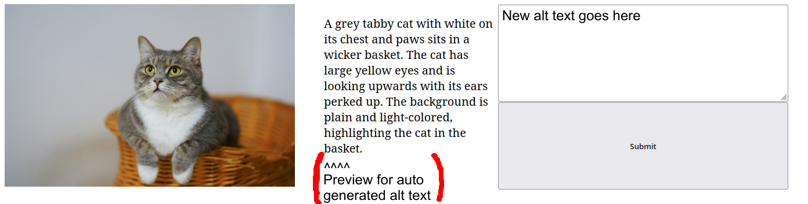

# Reddit Mastodon Bot

This is a bot that fetches an image from a specific subreddit to post on Mastodon every hour.
While the scheduler waits a full hour to post the image to Mastodon, it is already being processed in the background. This way, there is no extra delay, as image processing can sometimes take up to a few minutes.

Currently in use for: https://mas.to/@wholesomememes

## How to run

Clone the repository and cd into it.

    $ git clone https://github.com/Bilastend/wholesome
    $ cd wholesome

Create a virtual environment to run the bot *(recommended)*.

    $ python -m venv venv
    $ source venv/bin/activate

Install the packages in [requirements.txt](requirements.txt) using pip.

    $ pip install -r requirements.txt
    
Create a file called **statics.py** in the source directory of this repo and add the following lines to it:

    client_id = "The client id of your reddit Application"
    
    client_secret = "The client secret of your reddit Application"
    
    access_token = "The access token to your Mastodon application"

    api_base_url = "The url of the bot instance for example https://botsin.space"
    
    user_agent = "The user agent for Reddits API in this format: <platform>:<app ID>:<version string> (by /u/<reddit username>)"
    
    subreddit = "The name of your subreddit"

    open_ai_key = "OpenAI API key" # Skip this line if you don't want to use AI

You also need different libraries. In my case, Arch btw, install them like this:

    # pacman -S --needed enchant libvoikko aspell aspell-en
    
Run your Bot

    $ python main.py

## Alt-Text

It is possible to provide alt text with the posts.
There a three ways to do this:
- Manual
- AI (an OpenAI API key is needed)
- OCR (local Tesseract)

Todo it manually, there are two ways

- Access the webpage at http://[hostname]:8080. There you can see the image and the auto generated alt text (either ai or tesseract).
If you want to change it you can type your own alt text in the text area and press the submit button.

- Just create a file called 'alt_text.txt' in the source directory and write your alt text into the file. Before the image gets posted it will check if the file is present and the alt text will be added to the image, afterwards the file will be deleted. You have to check the console output for the image link.

When the image is first fetched and an OpenAI API key is provided in statics.py the bot will use it to generate alt text.
Tesseract is used as fallback option, in case no API key is provided or it simply fails e.g. for quota reasons.

Before adding a description from Tesseract it will check if the percentage of proper english words is over a certain threshold to make sure that the description generated makes any sense, if the check failes no auto generated alt text will be provided.

This is an example of what the website would look like.
(I have no idea how Front-end works please don't make fun of me)

